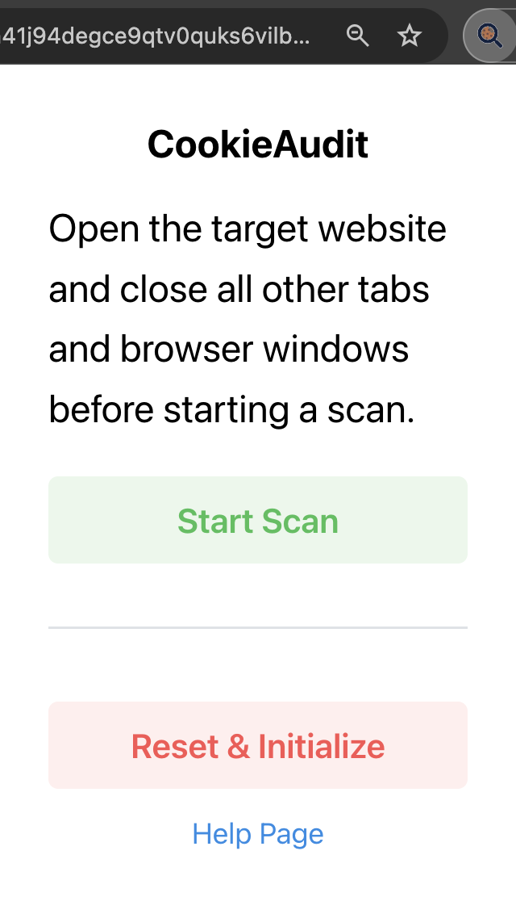
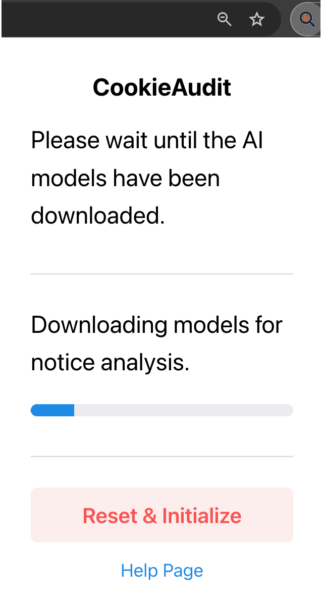
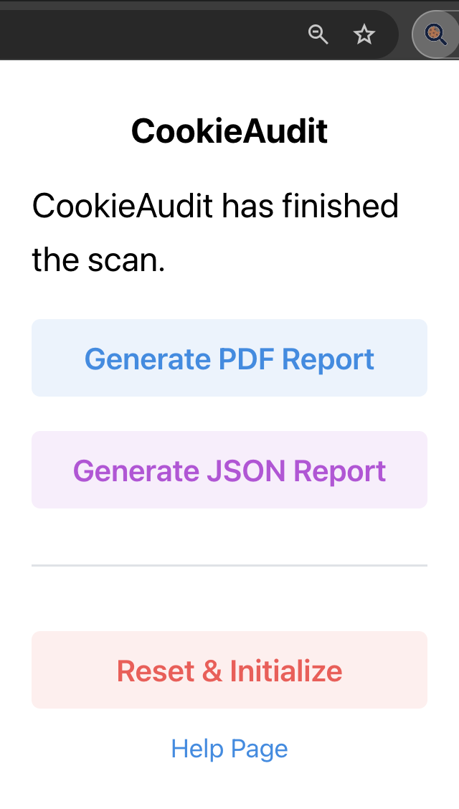
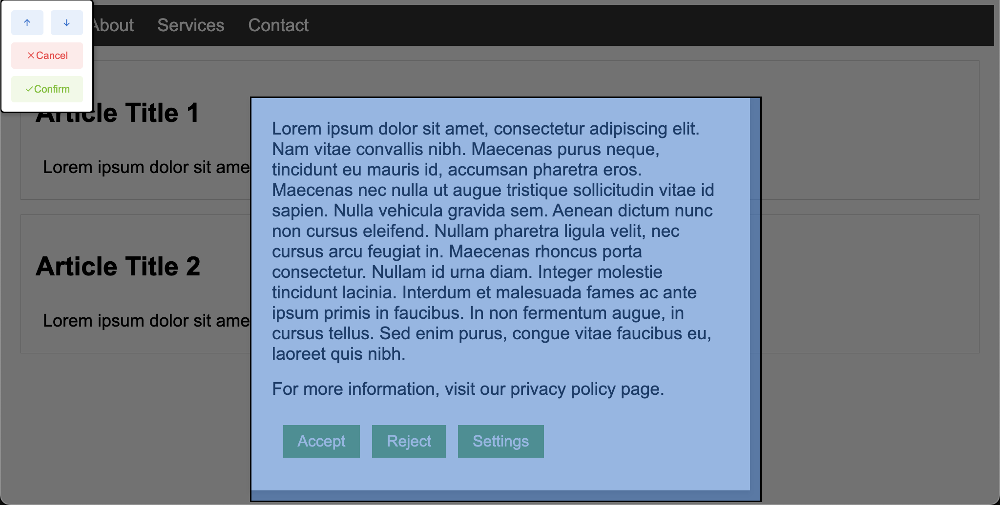

# CookieAudit

> [!IMPORTANT]
> ### TL;DR
>
> Lots of websites let you **"Reject"** tracking cookies — and then set them anyway. That's **illegal under EU law**, but catching it by hand means clicking the banner, sifting DevTools cookies, and repeating across subpages.
>
> **CookieAudit automates the whole loop and flags the cookies that shouldn't be there.**

CookieAudit is a Chromium browser extension that audits websites for compliance with the EU General Data Protection Regulation (GDPR) and the ePrivacy Directive (ePD). It analyzes consent popups, detects dark patterns, and classifies cookies set during a scan — producing both a human-readable PDF report and a machine-readable JSON report.

This version of CookieAudit is the outcome of the Bachelor's thesis ["Generalizing Browser Extension CookieAudit for Auditing Consent Popups' GDPR Compliance"](docs/thesis.pdf) by Szymon Nastaly, supervised by Prof. Dr. D. Basin, Dr. K. Kubicek, and A. Bouhoula at the Information Security Group, ETH Zürich (August 2024).

<p align="center">
  
  
  
</p>

<p align="center">
  
</p>

## Videos

https://github.com/user-attachments/assets/d397a04b-bfe2-4198-a56f-4a0f23b43057

Video 1 shows how to select the cookie notice and start the scan.

https://github.com/user-attachments/assets/8db26622-6360-4dc0-a034-8401bf763335

Video 2 shows the extension going through the cookie banner settings and analyzing them, finding all links and text.

https://github.com/user-attachments/assets/aad80829-1943-4225-86b3-0e9105f5e05a

Video 3 shows the extension interacting with the cookie banner (clicking deny), then scrolling through the page and subpages, and analyzing whether any cookies are set nonetheless — against the choice of the user.

## What's new in this version

The previous CookieAudit by Kubicek and Zanga et al. was restricted to a handful of Consent Management Platforms (CMPs), relied on hard-coded English/German keyword lists, and required the user to drive the entire scan manually. This version generalizes the extension to work on arbitrary cookie notices, regardless of CMP, by integrating the machine-learning and NLP models developed by Bouhoula et al. and Bollinger et al.

Key capabilities:

- **CMP-independent notice analysis** — the user points at the cookie notice once with a built-in element picker; the extension handles iframes, shadow DOM, and `<dialog>` containers.
- **NLP-based purpose detection** — a BERT model classifies notice text into "Purposes for Analytics/Advertising" vs. "Other Purposes" to verify the notice declares its data-collection purposes as required by the GDPR.
- **Interactive element classification** — a second BERT model labels buttons as `accept`, `reject`, `close`, `save`, `settings`, or `other`, so the extension can automatically interact with the notice.
- **Cookie classification** — uses the CookieBlock ensemble model (Bollinger et al.) to classify each cookie as `Necessary`, `Functional`, `Analytics`, or `Advertising`, and flags analytics/advertising cookies set before consent.
- **Automatic exploration** — after rejecting cookies, the extension visits and scrolls subpages to surface cookies that only appear beyond the landing page.
- **Dark pattern detection** — compares dominant button colors using the ΔE_ITP perceptual color difference metric (screenshot + k-means), checks typography differences, and tests whether the notice blocks interaction with the rest of the page ("forced action").
- **PDF + JSON reports** generated locally in the browser.

## Architecture

CookieAudit is built with [WXT](https://wxt.dev) (Manifest V3), React + Mantine for the popup UI, and runs the BERT models client-side via [Transformers.js](https://huggingface.co/docs/transformers.js). Models are downloaded once and cached by the browser.

```
entrypoints/
  background.js              service worker — scan orchestration
  selector.content/          element picker (handles iframes, shadow DOM, <dialog>)
  notifications.content/     in-page progress notifications
  noticeInteractor.js        clicks accept/reject/settings buttons
  pageInteractor.js          subpage navigation + scrolling
  cookieManagement.js        cookies.onChanged monitoring + classification
  checkInterfaceInterference.js  dominant-color + typography comparison
  checkForcedAction.js       link-clickability probe
  retrieveDataFromFirstNotice.js text + interactive-element extraction
  reportCreator.js           PDF (pdfmake) + JSON report generation
  popup/                     React UI
  onboarding/                first-install help page
  settings/
  modules/
```

## Build locally

Requires Node.js and `pnpm`.

```bash
pnpm install
pnpm dev           # Chrome, development
pnpm dev:firefox   # Firefox, development
pnpm build         # production build
pnpm zip           # bundle for the extension store
```

To load an unpacked build: Chrome → `chrome://extensions` → enable Developer mode → `Load unpacked` → select the build output directory.

## How to run a scan

1. Open the target website in a fresh tab.
2. Click the CookieAudit toolbar icon and press **Start Scan**.
3. When prompted, hover over the cookie notice and click it; confirm via the context menu in the top-left corner. If the notice exposes a settings dialog and CookieAudit can't locate it automatically, you'll be asked to pick it the same way.
4. CookieAudit then runs autonomously: it extracts notice text and buttons, classifies them, rejects cookies if a reject button exists, visits subpages, monitors cookies, and inspects the notice for dark patterns.
5. When the scan finishes, generate a **PDF report** or **JSON report** from the popup.

## Evaluation

In the thesis, CookieAudit was tested against the ground truth from Bouhoula et al.'s large-scale crawl on 70 websites (50 across 5 countries and 5 popularity tiers from the CrUX report, plus 20 covering the most popular CMPs):

| Criterion                            | Precision | Recall |
|--------------------------------------|-----------|--------|
| Reject button detection              | 0.82      | 1.00   |
| Implicit consent prior to interaction| 1.00      | 0.78   |
| Forced action                        | 0.86      | 0.68   |
| Interface interference               | 1.00      | 1.00   |

## References

- A. Bouhoula, K. Kubicek, A. Zac, C. Cotrini, D. Basin. *Automated Large-Scale Analysis of Cookie Notice Compliance.* USENIX Security 2024.
- D. Bollinger, K. Kubicek, C. Cotrini, D. Basin. *Automating Cookie Consent and GDPR Violation Detection.* USENIX Security 2022.
- K. Kubicek, D. Bollinger, A. Zanga, C. Cotrini, D. Basin. *CookieBlock & CookieAudit: Fixing Cookie Consent with ML.* USENIX Security 2022 (poster).

## Acknowledgments

Developed at the Information Security Group, Department of Computer Science, ETH Zürich.
