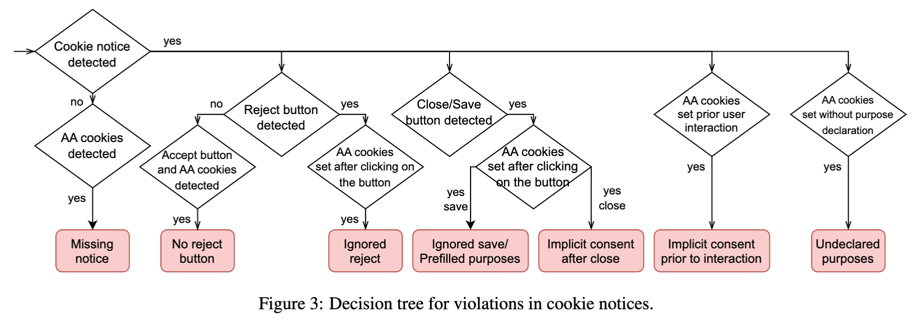

# Devlog
## May 15, 2024
### Working on flow of violations


### New content script: interactor.content
Here we wait for messages that say we should reload the webpage or click on a cookie notice element and scroll around.


## May 14, 2024
### Better sentence segmentation
Removed npm package for sentence segmentation. Now using Intl.Segmenter (browser built-in functionality).


## May 12, 2024
### Integrating interactive_elements_model
We load the models/tokenizer in a Promise.all() expression. Further we also classify the interactive elements
in a Promise.all() - in there we translate, classify, convert to a label, and store that label in the selection variable.
The local storage `selection` is then of the form:
```
{
  notice: {
    selector: 'some query selector',
    text: 'text of the notice',
    label: 0 (no analytics/advertising) | 1 (analytics/advertising detected)
  },
  interactiveObjects: [{
    selector: 'some query selector',
    text: 'text of the interactive element',
    label: integer label corresponding to the Purpose Object
  }]
}
```

## May 11, 2024
### ONNX conversion
Converting the models to ONNX is done using a script from the transformers.js library, e.g. for the interactive elements 
model it was done using: 
```shell
python3 -m scripts.convert --quantize --model_id ./interactive_elements_model --tokenizer_id bert-base-uncased --task text-classification
```
Note: this results in both a quantized and normal ONNX model. I have not made any comparisons in the quality of both.

TODO: Comparison of quantized and normal model.
### Integerating bert-based-uncased tokenizer into huggingface repos
I copied the `tokenizer.json` and `tokenizer_config.json` from
[bert-base-uncased-onnx](https://huggingface.co/Xenova/bert-base-uncased/tree/main) into the
[purpose_detection_model](https://huggingface.co/snastal/purpose_detection_model/tree/main). Now I can use the
`snastal/purpose_detection_model` in transformers.js as both Tokenizer and Model.

**The following described slowness is not true since integrating the tokenizer. It seems now that the non-quantized
version is fast enough.**
### Getting the non-quantized version to work
The non-quantized version works like this:
```javascript
let useQuantized = false;
let tokenizer = await AutoTokenizer.from_pretrained("snastal/purpose_detection_model", {quantized: useQuantized});
let model = await AutoModelForSequenceClassification.from_pretrained("snastal/purpose_detection_model", {
    quantized: useQuantized
});

// Actually run the model on the input text
let inputs = await tokenizer(text);
let res = await model(inputs);
```
Unfortunately, it is very slow (on my laptop 15s per sentence). Further, because the models are so big, we can only
classify one sentence after the other (so the following is not possible):
```javascript
let classifications = await Promise.all(sentences.map(async sentence => {
    let res = await classify(sentence);
    return getPrediction(res);
}));
```
If you were to run it in "parallel" like above, we get the error `RangeError: offset is out of bounds`, which probably
results directly from too much memory being used.
The following issues are related: https://github.com/xenova/transformers.js/issues/499, https://github.com/xenova/transformers.js/issues/492.

It probably will be fixed + made faster by transformers.js version 3 (which uses webgpu). 
Right now it is [in development](https://github.com/xenova/transformers.js/pull/545) and I cannot get it to work.
&rarr; I just get no result (but also no errors).

#### Update on May 16, 2024
By making 3 changes, the problem seems to have been fixed:
1. instead of initializing the tokenizer and model separately as before, we use the `pipeline API` as provided by
transformers.js: `pipeline("text-classification", "snastal/purpose_detection_model", {quantized: quantized});`
2. instead of classifying the different sentences and interactive elements (depending on the model), we use the possibility
of the pipeline API to provide an array of elements to classify: `await purposeClassifier(["one sentence.", "another sentence"])`
3. instead of creating the classifier (by calling `pipeline()`) always when need it, we now use a Singleton class that
stores the model as returned by `pipeline()`. This definitely helped (because the problem was not solved by the first two changes alone).
But it is strange that it helped at all, because:
    a. transformers.js uses the Cache API of the browser to cache the models (to not always download them from huggingface)
    b. background scripts are service workers in manifest v3 &rarr they are sometimes inactived and state should theoretically be reset

**For the future:** We need to keep an eye on transformer.js being updated to v3 as this should help in many ways. 
Additionally, it's not clear if the issue was resolved entirely, as often (with only the first two optimizations) the `RangeError` appeared only after
analysing many pages. 

## May 8, 2024
Remove the “storing” and “retrieving” of the transformer models (which are functions) to and from the [browser.storage](http://browser.storage) - because that doesn’t work for functions. Either way the models are somehow cached (or similar), because we (seemingly) don’t download them for every sentence seperately.

The BERT models are now finally working in the Cookie Audit 2 extension. The issue was that the permission to run `wasm` was not set inside the `manifest.json`. It took many hours (of trying other things) to find this out.
The classification of the purpose-detection-model returns logits of which we take the one with the biggest value. (index 0 means functional, index 1 means analytics/advertising). Then we sum up how many sentences describe analytics/advertising in the notice.

## May 7, 2024 
Added separate message: when content script has a confirmed cookie notice selector, it sends a message ___ to the extension service worker. The extension service worker then continues with the scan.
Splitting text to sentences is now done with an npm package called `sentence-splitter`. This is unfortunately necessary, as spacy does not run in javascript (at least it seems so).

Created first version of diagram to visualize the messaging that is going on between the components (namely the extension service worker, the popup and the content script).
Added reset (setting to empty objects) of the storage (`cookies`, `selection`, `scan` ) in the beginning of a new scan.
Learning: no usage of global variables (to store state) inside the background script, instead need to use `local storage` .